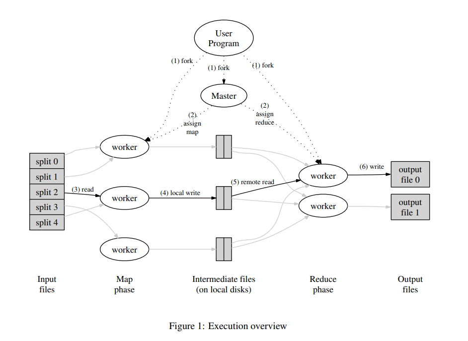

[toc]


## lab1

###  单词

```
..., as described above. 如上所述
Failing that: 否则
Granularity: 粒度
Periodically: 周期性的
Semantics: 语义
a factor of one hundred: 100倍
abort: 中止
across: 在各处
bandwidth: 带宽
be mapped by ... to ... : 由...映射到...
be notified by: 由...通知
bisection: 二等分
bounds: 界限
buffer: 缓存
cluster: 集群
conduit: 管道
conserve: 节约, 存储
considerably: 相当多, 很, 非常
constant factors: 常量因数
dual: 双重的
dynamic load balancing: 动态负载均衡
eligible: 有资格的, 合格的
ends up in: 结束于
given that: 鉴于, 考虑到
in-house: 内部存在的
in-progress: 正在进行中
incrementally: 逐渐的
iterate: 迭代
locality optimization: 局部优化
maintenance: 维持, 维护
megabits: 兆比特
multiple: 倍数
occurrences: 事情, 出现
on a failure: 发生故障时
operator: 运算符
out of: 从里面
over-all: 总的来说
parse: 分析, 解析
private: 私有的, 专用的
propagate: 传播
property: 财产, 属性
reason: 推理, 思考
replica: 复制品
replication: 复制
resilient: 有适应力, 可恢复的
scheduling: 调度, 安排
sequential: 连续的, 顺序的
so that: 因此
specify: 指定
spread out: 分散的
straggler: 掉队者
subdivide: 再分
underlying: 根本的, 底层的
weaker: 虚弱的
entries: 进入, 参与
```

---

### 论文

#### 文章

<u>**Execution Overview**</u>

---

```
The Map invocations are distributed across multiplemachines by automatically partitioning the input data into a set of M splits.
The input splits can be pro-cessed in parallel by different machines. Reduce invocations are distributed by partitioning the intermediate keyspace into R pieces using a partitioning function (e.g.,hash(key) mod R). The number of partitions (R) andthe partitioning function are specified by the user.
```

```
1. The MapReduce library in the user program first splits the input files into M pieces of typically 16megabytes to 64 megabytes (MB) per piece (con-trollable by the user via an optional parameter). It then starts up many copies of the program on a cluster of machines.
```

```
2. One of the copies of the program is special - the master.The rest are workers that are assigned workby the master.There are M map tasks and R reduce tasks to assign. The master picks idle workers and assigns each one a map task or a reduce task.
```

```
3. A worker who is assigned a map task reads the contents of the corresponding input split. It parses key/value pairs out of the input data and passes each pair to the user-defined Map function.The intermediate key/value pairs produced by the Map functionare buffered in memory.
```

```
4. Periodically, the buffered pairs are written to local disk, partitioned into R regions by the partitioning function. The locations of these buffered pairs on the local disk are passed back to the master，who is responsible for forwarding these locations to the reduce workers.
```

```
5. When a reduce worker is notified by the master about these locations, it uses remote procedure calls to read the buffered data from the local disks of the map workers. When a reduce worker has read all in termediate data, it sorts it by the intermediate keys so that all occurrences of the same key are grouped together. The sorting is needed because typically many different keys map to the same reduce task. If the amount of intermediate data is too large to fit in memory, an external sort is used.
```

```
6. The reduce worker iterates over the sorted intermediate data and for each unique intermediate key encountered, it passes the key and the corresponding set of intermediate values to the user's Reduce function.The output of the Reduce function is appended to a final output file for this reduce partition.
```

```
7. When all map tasks and reduce tasks have beencompleted, the master wakes up the user program.At this point, the MapReduce call in the user pro-gram returns back to the user code.
```

<u>**Master Data Structures**</u>

---

```
the master keeps several data structures.For each maptask and reduce task, it stores the state (idle, in-progress,or completed),and the identity of the worker machine(for non-idle tasks).
```

```
The master is the conduit through which the location of intermediate file regions is propagated from map tasks to reduce tasks.Therefore, for each completed map task,the master stores the locations and sizes of the R intermediate file regions produced by the map task. Updates to this location and size information are received as map tasks are completed. The information is pushed incrementally to workers that have in-progress reduce tasks.
```

---

**<u>Worker Failure</u>**

```
The master pings every worker periodically. If no re-sponse is received from a worker in a certain amount oftime, the master marks the worker as failed. Any maptasks completed by the worker are reset back to their initial idle state, and therefore become eligible for scheduling on other workers.Similarly, any map task or reducetask in progress on a failed worker is also reset to idle and becomes eligible for rescheduling.
```

```
Completed map tasks are re-executed on a failure because their output is stored on the local disk(s) of thefailed machine and is therefore inaccessible. Completedreduce tasks do not need to be re-executed since theiroutput is stored in a global file system.
```

**<u>Master Failure</u>**

```
lt is easy to make the master write periodic checkpoints of the master data structures described above. If the master task dies,a new copy can be started from the last checkpointed state. However, given that there is only a single master，its failure is unlikely; therefore our current implementation aborts the MapReduce computation if the master fails.Clients can check for this conditionand retry the MapReduce operation if they desire.
```

**<u>Semantics in the Presence of Failures</u>**

````
We rely on atomic commits of map and reduce task outputs to achieve this property. Each in-progress task writes its output to private temporary files.A reduce task produces one such file, and a map task produces R such files (one per reduce task). When a map task completes,the worker sends a message to the master and includes the names of the R temporary files in the message. If the master receives a completion message for an already completed map task, it ignores the message. Otherwise,it records the names of R files in a master data structure.
````

```
When a reduce task completes，the reduce worker atomically renames its temporary output file to the final output file. If the same reduce task is executed on multi-ple machines, multiple rename calls will be executed for the same final output file. We rely on the atomic rename operation provided by the underlying file system to guar-antee that the final file system state contains just the data produced by one execution of the reduce task.
```


---

#### 图片



### 实现

**<u>mrcoordinator.go</u>**

---

进行Coordinator初始化, 及相应操作的执行

```go
m := mr.MakeCoordinator(os.Args[1:], 10)
for m.Done() == false {
    time.Sleep(time.Second)
}
```

**<u>mrworker.go</u>**

---

加载map, reduce函数, 进行相应的操作

```go
mapf, reducef := loadPlugin(os.Args[1])
mr.Worker(mapf, reducef)
```

```go
func loadPlugin(filename string) (func(string, string) []mr.KeyValue, func(string, []string) string) {
	p, err := plugin.Open(filename)
	if err != nil {
		log.Fatalf("cannot load plugin %v", filename)
	}
	xmapf, err := p.Lookup("Map")
	if err != nil {
		log.Fatalf("cannot find Map in %v", filename)
	}
	mapf := xmapf.(func(string, string) []mr.KeyValue)
	xreducef, err := p.Lookup("Reduce")
	if err != nil {
		log.Fatalf("cannot find Reduce in %v", filename)
	}
	reducef := xreducef.(func(string, []string) string)

	return mapf, reducef
}
```

**<u>worker.go</u>** 

---

**数据结构定义**

```go
type KeyValue struct {
	Key   string
	Value string
}

type ByKey []KeyValue

func (a ByKey) Len() int           { return len(a) }
func (a ByKey) Swap(i, j int)      { a[i], a[j] = a[j], a[i] }
func (a ByKey) Less(i, j int) bool { return a[i].Key < a[j].Key }
```

**hash函数, 选择reduce**

```go
func ihash(key string) int {
	h := fnv.New32a()
	h.Write([]byte(key))
	return int(h.Sum32() & 0x7fffffff)
}
```

**获取coordiator的任务安排(work / reduce)**

```go 
func GetTask(finishedTask *TaskArgs) TaskReply {
	reply := TaskReply{}

	// send rpc request, wait for the reply
	// Coordinator.GetTask: we need GetTask function in Coordinator
	ok := call("Coordinator.GetTask", finishedTask, &reply)
	if !ok {
		fmt.Printf("call failed!\n")
		os.Exit(0)
	}
	return reply
}
```

**进行远程调用**

```go
func call(rpcname string, args interface{}, reply interface{}) bool {
	// c, err := rpc.DialHTTP("tcp", "127.0.0.1"+":1234")
	sockname := coordinatorSock()
	// 远程程序调用
	// 拨号
	// DialHTTP connects to an HTTP RPC server at the specified network address listening on the default HTTP RPC path.
	c, err := rpc.DialHTTP("unix", sockname)
	if err != nil {
		log.Fatal("dialing:", err)
	}
	defer c.Close()
	// fmt.Println(args)
	// os.Exit(0)
	// 调用具体方法
	// rpcname = Coordinator.GetTask
	err = c.Call(rpcname, args, reply)
	if err == nil {
		return true
	}

	fmt.Println(err)
	return false
}
```

**执行相应的具体操作(work / reduce)**

```go 
func Worker(mapf func(string, string) []KeyValue,
	reducef func(string, []string) string) {

	var newTask TaskReply
	var finishedTask TaskArgs = TaskArgs{DoneType: TaskTypeNone}
	// os.Exit(0)

	// Your worker implementation here.
	// showAndContinue("Worker", newTask, finishedTask)
	for {
		// showAndContinue("Worker", newTask, finishedTask)
		newTask = GetTask(&finishedTask)
		switch newTask.Type {
		case TaskTypeMap:
			f := newTask.Files[0]
			// read
			file, err := os.Open(f)
			if err != nil {
				log.Fatalf("cannot open %v", f)
			}
			defer file.Close()
			content, err := ioutil.ReadAll(file)
			if err != nil {
				log.Fatalf("cannot read %v", f)
			}
			// map function
			intermediate := mapf(f, string(content))
			// []KeyValue数组
			// 8 --> 10
			byReduceFiles := make(map[int][]KeyValue)
			for _, kv := range intermediate {
				idx := ihash(kv.Key) % newTask.NReduce
				byReduceFiles[idx] = append(byReduceFiles[idx], kv)
			}
			files := make([]string, newTask.NReduce)
			// int --> []KeyValue
			// rpc simulation
			for reduceId, kvs := range byReduceFiles {
				filename := fmt.Sprintf("mr-%d-%d", newTask.Id, reduceId)
				ofile, _ := os.Create(filename)
				defer ofile.Close()
				// 模拟远程传输json数据
				// To write key/value pairs in JSON format
				enc := json.NewEncoder(ofile)
				for _, kv := range kvs {
					// write kv
					err := enc.Encode(&kv)
					if err != nil {
						log.Fatal()
					}
				}
				files[reduceId] = filename
			}
			// files: [mr-0-0 mr-0-1 mr-0-2 mr-0-3 mr-0-4 mr-0-5 mr-0-6 mr-0-7 mr-0-8 mr-0-9]
			finishedTask = TaskArgs{DoneType: TaskTypeMap, Id: newTask.Id,
				Files: files}
		case TaskTypeReduce:
			intermediate := []KeyValue{}
			for _, filename := range newTask.Files {
				file, err := os.Open(filename)
				if err != nil {
					log.Fatalf("cannot open %v", filename)
				}
				defer file.Close()
				dec := json.NewDecoder(file)
				for {
					var kv KeyValue
					if err := dec.Decode(&kv); err != nil {
						break
					}
					intermediate = append(intermediate, kv)
				}
			}
			sort.Sort(ByKey(intermediate))
			oname := fmt.Sprintf("mr-out-%d", newTask.Id)
			ofile, _ := os.Create(oname)
			defer ofile.Close()
			i := 0
			for i < len(intermediate) {
				j := i + 1
				for j < len(intermediate) && intermediate[j].Key == intermediate[i].Key {
					j++
				}
				values := []string{}
				for k := i; k < j; k++ {
					values = append(values, intermediate[k].Value)
				}
				output := reducef(intermediate[i].Key, values)
				fmt.Fprintf(ofile, "%v %v\n", intermediate[i].Key, output)
				i = j
			}
			finishedTask = TaskArgs{DoneType: TaskTypeReduce, Id: newTask.Id,
				Files: []string{oname}}
		case TaskTypeSleep:
			time.Sleep(500 * time.Millisecond)
			finishedTask = TaskArgs{DoneType: TaskTypeNone}
		case TaskTypeExit:
			return
		default:
			panic(fmt.Sprintf("unknow type: %v", newTask.Type))
		}
	}

}
```

**<u>rpc.go</u>**

---

**数据结构定义**

```go
type TaskType int

const (
	TaskTypeNone TaskType = iota
	TaskTypeMap
	TaskTypeReduce 
	TaskTypeSleep
	TaskTypeExit
)

// finished task
type TaskArgs struct {
	DoneType TaskType
	Id       int
	Files    []string
}

// new task
type TaskReply struct {
	Type    TaskType
	Id      int
	Files   []string
	NReduce int
}
```

**套接字创建**

```go
func coordinatorSock() string {
	s := "/var/tmp/5840-mr-"
	// 强制类型转换 获取当前进程的实际用户 ID 
	s += strconv.Itoa(os.Getuid())
	return s
}

```

**<u>Coordinator.go</u>**


**数据结构定义**

```go
type MapTask struct {
	id      int       // task id
	file    string    // map task input file
	startAt time.Time // task start time (for timeout)
	done    bool      // is task finished
}

type ReduceTask struct {
	id      int       // task id
	files   []string  // reduce task input files (M files)
	startAt time.Time // task start time (for timeout)
	done    bool      // is task finished
}

type Coordinator struct {
	// Your definitions here.
	mutex        sync.Mutex   // lock to protect shared data below
	mapTasks     []MapTask    // all map tasks
	mapRemain    int          // of remaining map tasks
	reduceTasks  []ReduceTask // all reduce tasks
	reduceRemain int          // of remaining reduce tasks
}
```

**初始化**

```go
func MakeCoordinator(files []string, nReduce int) *Coordinator {
	// files := pg*.txt --> 8
	// nReduce := 10

	// Your code here.
	// init
	c := Coordinator{
		mapTasks:     make([]MapTask, len(files)),
		reduceTasks:  make([]ReduceTask, nReduce),
		mapRemain:    len(files),
		reduceRemain: nReduce,
	}
	for i, f := range files {
		c.mapTasks[i] = MapTask{id: i, file: f, done: false}
	}
	for i := 0; i < nReduce; i++ {
		c.reduceTasks[i] = ReduceTask{id: i, done: false}
	}
	c.server()
	return &c
}
```

**任务分配**

```go
func (c *Coordinator) GetTask(args *TaskArgs, reply *TaskReply) error {
	c.mutex.Lock()
	defer c.mutex.Unlock()
	// show("GetTask", args, args.DoneType)
	switch args.DoneType {
	case TaskTypeMap:
		if !c.mapTasks[args.Id].done {
			c.mapTasks[args.Id].done = true
			for reduceId, file := range args.Files {
				if len(file) > 0 {
					c.reduceTasks[reduceId].files = append(c.reduceTasks[reduceId].files, file)
				}
			}
			c.mapRemain--
		}
	case TaskTypeReduce:
		if !c.reduceTasks[args.Id].done {
			c.reduceTasks[args.Id].done = true
			c.reduceRemain--
		}
	}
	now := time.Now()
	timeoutAgo := now.Add(-10 * time.Second)
	// allocate
	// order from map to reduce
	if c.mapRemain > 0 {
		for idx := range c.mapTasks {
			t := &c.mapTasks[idx]
			// 未完成任务且有10s没有启动 --> 重新分配
			// 未开始的任务或被crash干掉的任务 ???
			// if !t.done && t.startAt.Before(timeoutAgo)
			if !t.done && t.startAt.Before(timeoutAgo) {
				reply.Type = TaskTypeMap
				reply.Id = t.id
				reply.Files = []string{t.file}
				reply.NReduce = len(c.reduceTasks)
				t.startAt = now
				return nil
			}
		}
		reply.Type = TaskTypeSleep
	} else if c.reduceRemain > 0 {
		for idx := range c.reduceTasks {
			t := &c.reduceTasks[idx]
			if !t.done && t.startAt.Before(timeoutAgo) {
				reply.Type = TaskTypeReduce
				reply.Id = t.id
				reply.Files = t.files
				t.startAt = now
				return nil
			}
		}
		reply.Type = TaskTypeSleep
	} else {
		reply.Type = TaskTypeExit
	}
	return nil
}
```

**rpc**

```go 
func (c *Coordinator) server() {
	rpc.Register(c)
	rpc.HandleHTTP()
	//l, e := net.Listen("tcp", ":1234")
	sockname := coordinatorSock()
	os.Remove(sockname)
	//The network must be "tcp", "tcp4", "tcp6", "unix" or "unixpacket".
	// Listen announces on the local network address.
	l, e := net.Listen("unix", sockname)
	if e != nil {
		log.Fatal("listen error:", e)
	}
	go http.Serve(l, nil)
}
```

具体工作完成判断

```go
func (c *Coordinator) Done() bool {
	c.mutex.Lock()
	defer c.mutex.Unlock()
	return c.mapRemain == 0 && c.reduceRemain == 0
}
```

