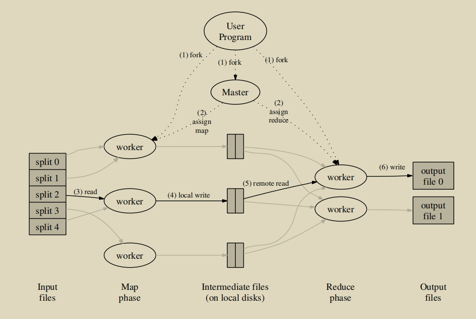
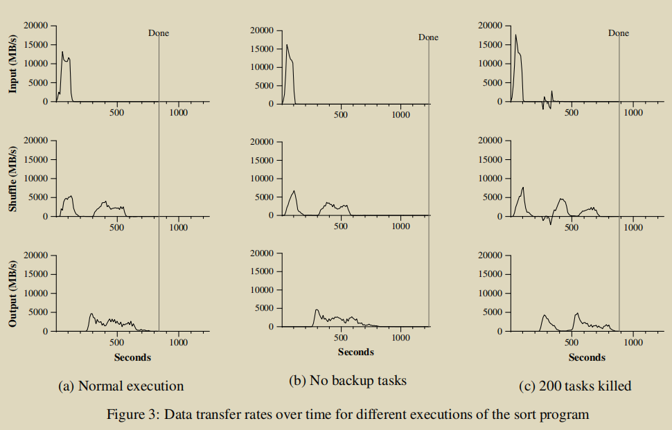
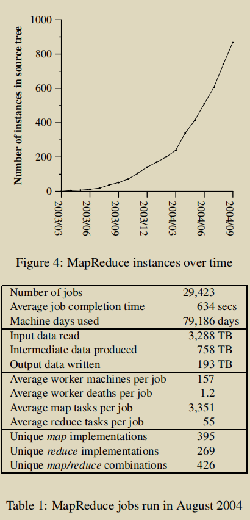

# MapReduce

[TOC]


## Abstract

`MapReduce`是一种编程模型，核心是使用`map`函数（接受一个键值对来产生一个中间键值对）和`reduce`函数（将同一个键的相关一组值合并产生一组规模更小的值）来处理数据


 

## 1 Introduction

`MapReduce`能将并行化，容错率，数据分发，负载均衡等细节隐藏在运行的程序之下

章节概要：


## 2 Programming Model

`MapReduce library`能合并相同的键并传递给`Reduce`函数。

`Reduce`函数输出的结果通常只有一个或零个值。

`intermediate values`通常存放在`iterator`中。

### Types

输入的键值对与中间键值对的域是不同的，中间键值对与输出的键值对的域是相同的。

### More Examples

- Distributed Grep

  将匹配的命令输出

- Count of URL Access Frequency

  对URL的访问频率进行计数

- Reverse Web-Link Graph

  将目标网页与其对应的所有源网页进行链接

- Term-Vector per Host

  将术语进行词频统计，得到常用术语

- Inverted Index

  统计文档内的单词，并返回(word, list(document))

- Distributed Sort

  分布式排序

##  3  Implementation

运行环境为与交换的以太网[^4]连接在一起的大型商品pc集群

### Execution Overview

将自动划分好的输入数据发送给多台计算机处理。中间键值对的存放空间由分区函数分割，分割数量和分割函数由用户定义

执行流程：



1. 切割输入文件
2. 由Master程序调度其他workers，分配任务
3. 分配了map task的workers通过`map`函数生成中间键值对
4. 将中间键值对写入本地磁盘，并由Master程序分配给reduce workers
5. 被Master分配了reduce task的workers读取所有中间键值对缓冲数据，排序后将相同键组合在一起
6. reduce workers对排序后的数据进行迭代，将相同键的键值对集中传给`reduce`函数处理，并将处理结果附加到该reduce workers对应的输出分区
7. 当所有map任务和reduce任务完成后，Master返回并调用用户代码

完成后，将所有reduce workers处理的结果通过调用另一个MapReduce或分布式应用合并

### Master Data Structures

Master将记录每个任务的状态（空闲，进行中或完成）和id（非空闲任务）；也记录每个中间文件（map task产生的）的位置和大小并及时更新和推送给reduce task

### Fault Tolerance

#### Worker Failure

对于任何失败的任务都将会被重置为初始状态，并重新分配给其他空闲的workers

由于中间文件存储在本地机器上，完成map task的机器出问题时，该任务将被重新分配执行。而reduce task输出结果存储在全局文件系统中则不用

当一个map task执行失败时，与其相关的reduce task也将重新执行，并从重新执行该task的机器上读取数据。

#### Master Failure

当主设备故障时，返回到最近一个检查点

#### Semantics in the Presence of Failures

当操作是确定的时候，基本上MapReduce上的操作与顺序执行是等价的

当操作是不确定的时候，特定的reduce task输出的结果与其顺序执行的情况等价，但与其不通顺序下执行的结果可能相等

### Locality

每一对map/reduce task会在位于同一网络交换机上的文件系统基于GFS[^8]的机器上执行

### Task Granularity

map task和reduce task会分别分成M和R份，M和R大小与执行任务的机器成倍数关系

### Backup Tasks

当MapReduce操作接近完成时，剩下的每个任务将会备份给几个机器执行，只要任意一个机器完成，该任务就算完成

[^4]:  Luiz A. Barroso, Jeffrey Dean, and Urs Holzle. Web search for a planet: The Google cluster architecture. IEEE Micro, 23(2):22–28, April 2003.
[^8]: Sanjay Ghemawat, Howard Gobioff, and Shun-Tak Leung. The Google file system. In 19th Symposium on Operating Systems Principles, pages 29–43, Lake George, New York, 2003.

##  4 Refinements

### Partitioning Function

用户可指定reduce task和输出文件的数量R以及如何划分

### Ordering Guarantees

每个分区的中间键值对按键/值以递增的方式排序

### Combiner Function

每个map任务产生的中间键由`Combiner`函数进行合并后写入中间文件，以便进行传送

### Input and Output Types

MapReduce库支持读取几种不同格式的输入数据

### Side-effects

依靠程序编写者在处理map/reduce操作时生成的中间文件，使副作用原子化和幂等化（idempotent）

### Skipping Bad Records

Master将会把安装在每个进程上的用于捕获错误的程序参数存储在全局变量中。当Master收到某个特定记录的错误超过一次时，将会跳过该记录

### Local Execution

可以在本地机器上顺序执行MapReduce的所有操作或特定的map task，以便调试

### Status Information

Master提供一个状态面板以供使用人员查看处理进度及相关信息和操作

### Counters

MapReduce库提供了一个计数器工具来计算各种事件的发生次数

## 5 Performance

### Sort

排序程序对10^10^个100字节的记录（大约1TB的数据）进行排序（这个程序是模仿TeraSort基准测试[^10]设计的）。

`map`函数从一个文本行中提取一个10字节的排序键，值为原始文本行。

`reduce`函数直接将输入的中间键值对作为输出。

最后排好序的输出文件被写入到一组双向复制的GFS文件中（即输出文件总大小为2TB）。

输入数据被分割成M=15000份、单个64MB大小的文件，输出文件为R=4000份。



- 左上图片为读取输入文件的速率变化过程。峰值为13GB/s，之后迅速下降，因为map task在200s之前完成。其中一半的时间都花在排序map tasks，将中间输出写入本地磁盘也花费不少时间
- 左中图片为将map tasks处理完的数据发送到reduce tasks的速率变化过程。当第一个map task完成时就开始发送。第一个驼峰是针对第一批大约1700个reduce tasks（整个MapReduce被分配了大约1700台机器，每台机器一次最多执行一个reduce tasks）。300s后，开始第二批reduce tasks。所有的发送任务在600s左右完成
- 左下图片为将reduce tasks结果写入到输出文件的速率变化过程。在第一批reduce tasks完成时，写入还延迟的一段时间才开始是因为还在对中间数据进行排序。所有写入操作用时850s，包含启动开销则为891s。这与TeraSort基准测试[^18]目前报告的1057秒的最佳报告结果相似

### Effect of Backup Tasks

在图b中，由于关闭了备份程序，在960s后仍有5个reduce tasks还未完成，直到1283s才完成，相较正常运行的程序，增加了44%的时间

### Machine Failures

在图c中，计算过程中故意杀死了1746个进程中的200个，整个过程并没有受到太大影响，包括启动开销在内耗时共933s。右上图有部分为负的是因为部分map tasks由于200个进程关闭，需要重新处理的任务数量

[^10]:Jim Gray. Sort benchmark home page. http://research.microsoft.com/barc/SortBenchmark/.

[^18]: Jim Wyllie. Spsort: How to sort a terabyte quickly. http://alme1.almaden.ibm.com/cs/spsort.pdf.

## 6 Experience

应用的领域：

- large-scale machine learning problems
- clustering problems for the Google News and Froogle products
- extraction of data used to produce reports of popular queries (e.g. Google Zeitgeist)
- extraction of properties of web pages for new experiments and products (e.g. extraction of geographical locations from a large corpus of web pages for localized search)
- large-scale graph computations



### Large-Scale Indexing

在大型索引系统上使用MapReduce的好处：

- 索引代码更简单、更小、更容易理解，因为处理容错、分布和并行化的代码隐藏在MapReduce库中
- 可以将概念上不相关的计算分开，而不是将它们混合在一起以避免额外的数据传递
- 索引过程变得更容易操作，因为由机器故障、机器速度慢和网络中断引起的大多数问题都由MapReduce库自动处理。并且向索引集群添加新的机器也很容易

## 7 Related Work

- MapReduce是对这些模型（例如使用并行前缀计算[^6][^9][^13]在N个处理器上以N个N个元素数组的所有前缀计算关联函数）的简化和精馏
- `Bulk Synchronous Programming`[^17]和一些MPI原语[^11]提供了更高的抽象。但区别在于，MapReduce利用一个`restricted programming`模型来自动并行化用户程序，并提供透明的容错
- 受论文[^12][^13][^14][^15]的启发，我们的局部性优化使得计算在靠近数据的本地磁盘附近，以减少通过 I/O子系统或网络发送的数据量
- 用跳过不良记录的机制解决了急切调度机制[^3]中给定的任务导致重复失败使整个计算将无法完成的问题
- MapReduce实现依赖于一个内部集群管理系统，该系统负责在大量共享机器上分发和运行用户任务。与之相似的系统有Condor[^16]
- 作为MapReduce库的一部分，排序工具在操作上类似于NOW-Sort[^1]
- River[^2]提供了一个编程模型，其中进程通过分布式队列发送数据来相互通信；它通过仔细安排磁盘和网络传输来实现平衡的完成时间。MapReduce有一种不同的方法。通过`restricted programming`模型，MapReduce框架能够将问题划分成大量细粒度的任务
- BAD-FS[^5]是通过广域网执行作业的过程。然而，与MapReduce有两个基本的相似之处：
  1. 两个系统都使用冗余执行来恢复由故障引起的数据丢失
  2. 两者都使用位置感知调度来减少通过拥挤的网络链路发送的数据量
- TACC[^7]是一个旨在简化高可用性网络服务构建的系统。像MapReduce一样，它依赖重新执行作为实现容错的机制

[^1]:  Andrea C. Arpaci-Dusseau, Remzi H. Arpaci-Dusseau, David E. Culler, Joseph M. Hellerstein, and David A. Patterson. High-performance sorting on networks of workstations. In Proceedings of the 1997 ACM SIGMOD International Conference on Management of Data, Tucson, Arizona, May 1997.
[^2]:  Remzi H. Arpaci-Dusseau, Eric Anderson, Noah Treuhaft, David E. Culler, Joseph M. Hellerstein, David Patterson, and Kathy Yelick. Cluster I/O with River: Making the fast case common. In Proceedings of the Sixth Workshop on Input/Output in Parallel and Distributed Systems (IOPADS ’99), pages 10–22, Atlanta, Georgia, May 1999.
[^3]: Arash Baratloo, Mehmet Karaul, Zvi Kedem, and Peter Wyckoff. Charlotte: Metacomputing on the web. In Proceedings of the 9th International Conference on Parallel and Distributed Computing Systems, 1996.
[^5]:  John Bent, Douglas Thain, Andrea C.Arpaci-Dusseau, Remzi H. Arpaci-Dusseau, and Miron Livny. Explicit control in a batch-aware distributed file system. In Proceedings of the 1st USENIX Symposium on Networked Systems Design and Implementation NSDI, March 2004.
[^6]:  Guy E. Blelloch. Scans as primitive parallel operations. IEEE Transactions on Computers, C-38(11), November
1989.
[^7]: Armando Fox, Steven D. Gribble, Yatin Chawathe, Eric A. Brewer, and Paul Gauthier. Cluster-based scalable network services. In Proceedings of the 16th ACM Symposium on Operating System Principles, pages 78–91, Saint-Malo, France, 1997.
[^9]:  S. Gorlatch. Systematic efficient parallelization of scan and other list homomorphisms. In L. Bouge, P. Fraigniaud, A. Mignotte, and Y. Robert, editors, Euro-Par’96. Parallel Processing, Lecture Notes in Computer Science 1124, pages 401–408. Springer-Verlag, 1996.
[^11]: William Gropp, Ewing Lusk, and Anthony Skjellum. Using MPI: Portable Parallel Programming with the Message-Passing Interface. MIT Press, Cambridge, MA,1999.
[^12]: L. Huston, R. Sukthankar, R. Wickremesinghe, M. Satyanarayanan, G. R. Ganger, E. Riedel, and A. Ailamaki. Diamond: A storage architecture for early discard in interactive search. In Proceedings of the 2004 USENIX File and Storage Technologies FAST Conference, April 2004.
[^13]: Richard E. Ladner and Michael J. Fischer. Parallel prefix computation. Journal of the ACM, 27(4):831–838, 1980.
[^14]: Michael O. Rabin. Efficient dispersal of information for security, load balancing and fault tolerance. Journal of the ACM, 36(2):335–348, 1989.
[^15]:  Erik Riedel, Christos Faloutsos, Garth A. Gibson, and David Nagle. Active disks for large-scale data processing. IEEE Computer, pages 68–74, June 2001.
[^16]: Douglas Thain, Todd Tannenbaum, and Miron Livny. Distributed computing in practice: The Condor experience. Concurrency and Computation: Practice and Experience, 2004.
[^17]: L. G. Valiant. A bridging model for parallel computation. Communications of the ACM, 33(8):103–111, 1997.


## Conclusions

1. `restricted programming`模型使得并行化和分布计算变得容易，并且使得这样的计算具有容错性
2. 网络带宽是稀缺资源。因此，我们系统中的许多优化旨在减少通过网络发送的数据量：局部性优化允许我们从本地磁盘读取数据，将中间数据的单个副本写入本地磁盘可以节省网络带宽
3. 冗余执行可以用来减少慢速机器的影响，并处理机器故障和数据丢失

## A Word Frequency

本节包含一个程序，该程序计算命令行上指定的一组输入文件中每个唯一单词的出现次数

```c++
#include "mapreduce/mapreduce.h"
// User’s map function
class WordCounter : public Mapper {
public:
	virtual void Map(const MapInput& input) {
        const string& text = input.value();
        const int n = text.size();
        for (int i = 0; i < n; ) {
        // Skip past leading whitespace
        while ((i < n) && isspace(text[i]))
        	i++;
        
        // Find word end
        int start = i;
        while ((i < n) && !isspace(text[i]))
        	i++;
        if (start < i)
        	Emit(text.substr(start,i-start),"1");
        }
	}
};
REGISTER_MAPPER(WordCounter);

// User’s reduce function
class Adder : public Reducer {
    virtual void Reduce(ReduceInput* input) {
        // Iterate over all entries with the
        // same key and add the values
        int64 value = 0;
        while (!input->done()) {
            value += StringToInt(input->value());
            input->NextValue();
        }
        
        // Emit sum for input->key()
        Emit(IntToString(value));
    }
};
REGISTER_REDUCER(Adder);

int main(int argc, char** argv) {
    ParseCommandLineFlags(argc, argv);
    
    MapReduceSpecification spec;
    
    // Store list of input files into "spec"
    for (int i = 1; i < argc; i++) {
        MapReduceInput* input = spec.add_input();
        input->set_format("text");
        input->set_filepattern(argv[i]);
        input->set_mapper_class("WordCounter");
    }
    
    // Specify the output files:
    // /gfs/test/freq-00000-of-00100
    // /gfs/test/freq-00001-of-00100
    // ...
    MapReduceOutput* out = spec.output();
    out->set_filebase("/gfs/test/freq");
    out->set_num_tasks(100);
    out->set_format("text");
    out->set_reducer_class("Adder");
    
    // Optional: do partial sums within map
    // tasks to save network bandwidth
    out->set_combiner_class("Adder");
    
    // Tuning parameters: use at most 2000
    // machines and 100 MB of memory per task
    spec.set_machines(2000);
    spec.set_map_megabytes(100);
    spec.set_reduce_megabytes(100);
    
    // Now run it
    MapReduceResult result;
    if (!MapReduce(spec, &result)) abort();
    
    // Done: ’result’ structure contains info
    // about counters, time taken, number of
    // machines used, etc.
    
    return 0;
}
```
