# RPC

## RPC

[参考](https://books.studygolang.com/advanced-go-programming-book/ch4-rpc/readme.html)

Go语言的RPC规则：方法只能有两个可序列化的参数，其中第二个参数是指针类型，并且返回一个error类型，同时必须是公开的方法。



```go
// server.go
type HelloService struct {}

func (p *HelloService) Hello(request string, reply *string) error {
    *reply = "hello:" + request
    return nil
}

// 将Example类型的对象注册为一个RPC服务
func main() {
    // rpc.Register(或rpc.RegisterName)函数调用会将对象类型中所有满足RPC规则的对象方法注册为RPC函数，所有注册的方法会放在“HelloService”服务空间之下。
    rpc.RegisterName("HelloService", new(HelloService))
	
    // 建立一个唯一的TCP链接
    listener, err := net.Listen("tcp", ":1234")
    if err != nil {
        log.Fatal("ListenTCP error:", err)
    }

    conn, err := listener.Accept()
    if err != nil {
        log.Fatal("Accept error:", err)
    }
    
	// 通过rpc.ServeConn函数在该TCP链接上为对方提供RPC服务
    rpc.ServeConn(conn)
}
```

```go
// client.go
func main() {
    // 通过rpc.Dial拨号RPC服务
    client, err := rpc.Dial("tcp", "localhost:1234")
    if err != nil {
        log.Fatal("dialing:", err)
    }

    var reply string
    // 通过client.Call调用具体的RPC方法。在调用client.Call时，第一个参数是用点号链接的RPC服务名字和方法名字，第二和第三个参数分别我们定义RPC方法的两个参数。
    err = client.Call("HelloService.Hello", "hello", &reply)
    if err != nil {
        log.Fatal(err)
    }

    fmt.Println(reply)
}
```

### 更安全的RPC接口

在涉及RPC的应用中，作为开发人员一般至少有三种角色：首选是服务端实现RPC方法的开发人员，其次是客户端调用RPC方法的人员，最后也是最重要的是制定服务端和客户端RPC接口规范的设计人员。

重构HelloService服务，第一步需要明确服务的名字和接口：

```go
const HelloServiceName = "path/to/pkg.HelloService"

type HelloServiceInterface = interface {
    Hello(request string, reply *string) error
}

func RegisterHelloService(svc HelloServiceInterface) error {
    return rpc.RegisterName(HelloServiceName, svc)
}
```


## race

对共享状态进行争抢的多线程编程。

### CAS机制

[参考](https://cloud.tencent.com/developer/article/1534229)

CAS是一种乐观锁，乐观锁的核心思路就是**每次不加锁而是假设修改数据之前其他线程一定不会修改，如果因为修改过产生冲突就失败就重试，直到成功为止。**CAS机制就是一种。可以理解成一个**无阻塞**多线程争抢资源的模型。


CAS 操作包含三个操作数 —— 内存地址（V）、旧的预期值（A）和即将要更新的新值(B)。执行CAS操作的时候，将内存位置的值与预期原值比较，如果相匹配，那么处理器会自动将该位置值更新为新值。否则，处理器不做任何操作。


## Multi-thread programming

完整样例：[crawler.go](http://nil.csail.mit.edu/6.824/2020/notes/crawler.go)

目的：爬取网页及该网页上包含的每个链接的网页，递归的提取所有的网页

```go
//
// Several solutions to the crawler exercise from the Go tutorial
// https://tour.golang.org/concurrency/10
//

//
// Serial crawler
//

func Serial(url string, fetcher Fetcher, fetched map[string]bool) {
	if fetched[url] {
		return
	}
	fetched[url] = true
	urls, err := fetcher.Fetch(url)
	if err != nil {
		return
	}
	for _, u := range urls {
		Serial(u, fetcher, fetched)
	}
	return
}

//
// Concurrent crawler with shared state and Mutex
//

type fetchState struct {
	mu      sync.Mutex
	fetched map[string]bool
}

func ConcurrentMutex(url string, fetcher Fetcher, f *fetchState) {
	f.mu.Lock()
	already := f.fetched[url]
	f.fetched[url] = true
	f.mu.Unlock()

	if already {
		return
	}

	urls, err := fetcher.Fetch(url)
	if err != nil {
		return
	}
	var done sync.WaitGroup
	for _, u := range urls {
		done.Add(1)
        u2 := u
		go func() {
			defer done.Done()
			ConcurrentMutex(u2, fetcher, f)
		}()
		//go func(u string) {
		//	defer done.Done()
		//	ConcurrentMutex(u, fetcher, f)
		//}(u)
	}
	done.Wait()
	return
}

func makeState() *fetchState {
	f := &fetchState{}
	f.fetched = make(map[string]bool)
	return f
}

//
// Concurrent crawler with channels
//

func worker(url string, ch chan []string, fetcher Fetcher) {
	urls, err := fetcher.Fetch(url)
	if err != nil {
		ch <- []string{}
	} else {
		ch <- urls
	}
}

func master(ch chan []string, fetcher Fetcher) {
	n := 1
	fetched := make(map[string]bool)
	for urls := range ch {
		for _, u := range urls {
			if fetched[u] == false {
				fetched[u] = true
				n += 1
				go worker(u, ch, fetcher)
			}
		}
		n -= 1
		if n == 0 {
			break
		}
	}
}

func ConcurrentChannel(url string, fetcher Fetcher) {
	ch := make(chan []string)
	go func() {
		ch <- []string{url}
	}()
	master(ch, fetcher)
}

//
// Fetcher
//

type Fetcher interface {
	// Fetch returns a slice of URLs found on the page.
	Fetch(url string) (urls []string, err error)
}

// fakeFetcher is Fetcher that returns canned results.
type fakeFetcher map[string]*fakeResult

type fakeResult struct {
	body string
	urls []string
}

func (f fakeFetcher) Fetch(url string) ([]string, error) {
	if res, ok := f[url]; ok {
		fmt.Printf("found:   %s\n", url)
		return res.urls, nil
	}
	fmt.Printf("missing: %s\n", url)
	return nil, fmt.Errorf("not found: %s", url)
}
```


